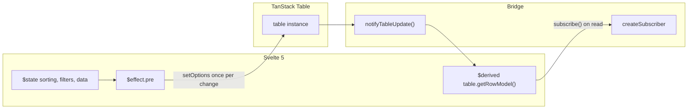

# Svelte 5 reactivity in svelte-tablecn

TanStack Table is **not** a Svelte library. It keeps its own state and notifies via callbacks. Svelte 5 uses **runes** (`$state`, `$derived`, `$effect`) and **`createSubscriber`** to connect foreign systems.

## The deal (why things felt broken)

We had **two different** integration styles:

| Layer | Pattern | Result |
|-------|---------|--------|
| **Data grid** (`useDataGrid`) | `$state` + `$effect.pre` → `table.setOptions` + `createSubscriber` on read | Correct |
| **Data table** (`createSvelteTable`) | Proxy called `setOptions` on **every** `table.getRowModel()` etc. | Loops, freezes, filters fighting the UI |

Calling `setOptions` inside a Proxy `get` trap tells TanStack “everything changed” on each read. That re-runs row models, faceting, and Svelte effects, which read the table again → feedback loop. Band-aids (memoized `filterRows`, JSON snapshots) helped symptoms but not the cause.

## The intended architecture



### 1. Own app state in Svelte (`$state`)

Sorting, filters, pagination, and row data live in `useDataTable` / `useDataGrid` as `$state`. Pass them into the table with getters:

```ts
createSvelteTable({
  get data() { return rows },
  get state() {
    return { sorting, columnFilters, pagination, /* ... */ };
  },
  onColumnFiltersChange: (up) => { columnFilters = functionalUpdate(up) }
});
```

### 2. Push into TanStack once per change (`$effect.pre`)

When any tracked input changes, run **one** `table.setOptions(...)`. This is what `useDataGrid` already does; `createSvelteTable` now does the same.

### 3. Pull UI updates out (`createSubscriber`)

Components use `$derived(table.getRowModel().rows)`. Each read goes through a Proxy that calls `subscribe()`. When table data changes, call `notifyTableUpdate()` so Svelte re-runs those derivations.

**Do not** call `setOptions` in the Proxy.

### 4. Advanced client filters

With `enableAdvancedFilter` and `manualFiltering: false`, `useDataTable` pre-filters rows in the `data` getter and sets `manualFiltering: true` on the table so TanStack does not apply per-column `filterFn` twice. Filtered output is **memoized** so `data` keeps a stable reference when inputs are unchanged.

## Rules for new code

1. **No `$effect` that writes state derived from the same state** (e.g. syncing `filterItems` from `table.getState()` without a snapshot guard).
2. **Do not destructure `useDataTable()`** — `const { columnFilters } = useDataTable()` freezes the initial `[]` and breaks filters. Use `const dataTable = useDataTable()` and `dataTable.table` in templates.
3. **Pass `dataTable.setColumnFilters` into filter components** — updates Svelte `$state` directly; the table syncs via `$effect.pre`.
4. **URL sync** (`useDataTable`) uses snapshots + `isApplyingQueryState` so `pushState` does not echo back into filters.
5. Prefer **`$effect.pre`** for syncing into non-Svelte systems; use **`untrack`** when reading for side effects only.

## Files

| File | Role |
|------|------|
| `src/lib/components/ui/data-table/data-table.svelte.ts` | `createSvelteTable` bridge |
| `src/lib/hooks/use-data-table.svelte.ts` | Table state, URL sync, client `filterRows` |
| `src/lib/hooks/use-data-grid.svelte.ts` | Reference implementation of the same bridge |
| `src/lib/filter-rows.ts` | Client advanced filter engine |

## References

- [createSubscriber](https://svelte.dev/docs/svelte/svelte-reactivity#createSubscriber)
- [tablecn advanced filters](./ADVANCED_FILTERS.md)
